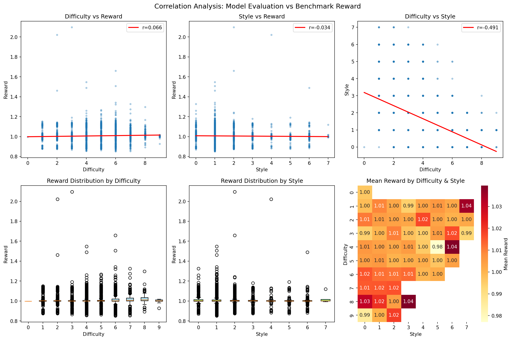

# dp-experiments

Experiments for filtering and evaluating Triton kernel datasets for SFT (Supervised Fine-Tuning).

## Overview

This project processes the `siro1/kernelbook-glm4-evals` dataset to:
1. Filter high-quality samples (reward > 0.85)
2. Evaluate difficulty and code style using LLM-as-judge (GPT-5.2)
3. Analyze correlations between model evaluations and benchmark performance
4. Generate synthetic task prompts from PyTorch modules
5. Prepare datasets for SFT training

## Results

### Datasets on HuggingFace

| Dataset | Samples | Description |
|---------|---------|-------------|
| [kernelbook-glm4-evals](https://huggingface.co/datasets/siro1/kernelbook-glm4-evals) | 18,162 | Original dataset with PyTorch modules and Triton kernels |
| [kernelbook-glm4-evals-filtered](https://huggingface.co/datasets/siro1/kernelbook-glm4-evals-filtered) | 7,181 | Filtered by reward > 0.85 with difficulty/style ratings |
| [kernelbook-glm4-evals-unique](https://huggingface.co/datasets/siro1/kernelbook-glm4-evals-unique) | 2,967 | Deduplicated by module name |

### Key Findings

**Correlation Analysis:**
- Difficulty vs Reward: r = +0.07 (negligible positive)
- Style vs Reward: r = -0.03 (negligible)
- Difficulty vs Style: r = -0.49 (moderate negative)

**Conclusion:** Benchmark reward is largely independent of LLM-judged difficulty and style. The negative correlation between difficulty and style suggests the model rates harder tasks as having lower code quality.

### Visualizations



## Usage

### Setup

```bash
# Clone and install
git clone https://github.com/yourusername/dp-experiments.git
cd dp-experiments
uv sync

# Configure credentials
cp .env.example .env
# Edit .env with your API keys
```

### Run Pipeline

```bash
# Filter dataset (evaluates 7,181 samples)
uv run python scripts/filter_dataset.py

# Generate synthetic prompts from PyTorch modules (18,162 samples)
uv run python scripts/generate_prompts.py

# Analyze correlations
uv run python scripts/analyze_correlation.py

# Deduplicate
uv run python scripts/keep_best.py

# Upload datasets to HuggingFace
uv run python scripts/upload_datasets.py
```

### Test Mode

```bash
TEST_MODE=true uv run python scripts/filter_dataset.py
```

## Project Structure

```
dp-experiments/
├── scripts/           # Python scripts
│   ├── filter_dataset.py      # Main filtering pipeline
│   ├── generate_prompts.py    # Synthetic prompt generation
│   ├── analyze_correlation.py # Correlation analysis
│   ├── keep_best.py           # Deduplication
│   └── upload_datasets.py     # Upload to HuggingFace
├── outputs/           # Generated datasets (gitignored)
├── plots/             # Visualization outputs
├── CLAUDE.md          # AI assistant instructions
└── README.md          # This file
```

## Evaluation Criteria

### Difficulty Scale (0-10)
| Score | Description |
|-------|-------------|
| 0 | Trivial copy/identity kernel |
| 1-2 | Simple elementwise (relu, add, multiply) |
| 3-4 | Basic reductions or fused operations |
| 5-6 | Moderate (softmax, layernorm, basic attention) |
| 7-8 | Complex (full attention, conv2d, fusions) |
| 9-10 | Advanced (FlashAttention, ResNet blocks) |

### Style Scale (0-10)
| Score | Description |
|-------|-------------|
| 0-1 | Broken or unreadable |
| 2-3 | Messy but functional |
| 4-5 | Acceptable, standard patterns |
| 5-6 | Good structure, follows conventions |
| 7-8 | Very good, efficient memory patterns |
| 9-10 | Excellent, optimal and educational |

## Requirements

- Python 3.13+
- [uv](https://github.com/astral-sh/uv) package manager
- Prime Intellect API key
- HuggingFace token (for uploads)

## License

MIT
